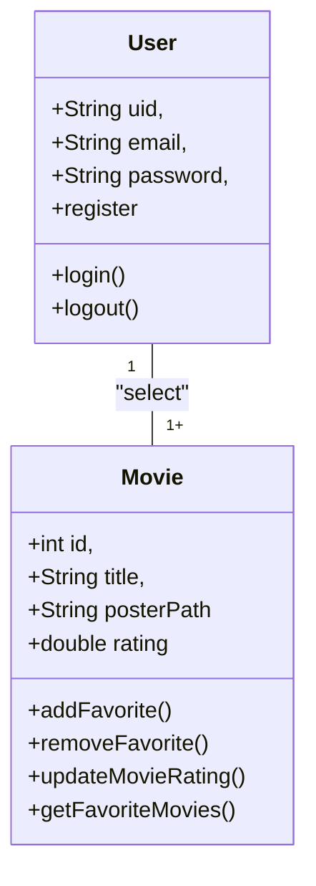

# CineFavorite (Formativa)

## Briefing 
Construir um Aplicativo do Zero - O CineFavorite que permitirá criar uma conta e buscar filmes em uma API, montar uma galeria pessoal de filmes favoritos, com poster (capa) e nota avaliativa do usuário para o filme.

## Objetivos
- Criar uma Galeria Personalizada por Usuário de Filmes Favoritos
- Buscar filmes em uma API e Listar para selecionar filmes favoritos
- Criação de contas por usuário
- Listar filmes por Palavra-chave

## Levantamento de Requisitos
- ### Funcionais
 - O sistema deve permitir que o usuário crie uma conta (registro) com email e senha.
 - O sistema deve permitir que o usuário faça login com credenciais válidas.
 - O sistema deve permitir que o usuário faça logout da aplicação.
 O usuário deve poder buscar filmes por palavra-chave na API do TMDB.
 - O sistema deve exibir informações básicas do filme (título, poster, descrição/resumo).
 - O usuário deve poder adicionar filmes aos favoritos.
 - O usuário deve poder remover filmes dos favoritos.
 - O usuário deve poder atribuir uma nota/avaliação ao filme favorito.
 - O sistema deve exibir a galeria personalizada de filmes favoritos do usuário.
 - O sistema deve salvar os favoritos de cada usuário no banco de dados (Firebase Firestore).

- ### Não Funcionais
- As credenciais de usuário devem ser protegidas usando Firebase Authentication.
- O sistema deve validar entradas (ex.: email válido, senha forte).
- Somente o dono da conta deve ter acesso à sua galeria de favoritos.
- O aplicativo deve funcionar em dispositivos Android e iOS (via Flutter).
- O sistema deve se integrar corretamente com a API do TMDB e Firebase.

## Recurso do projeto
- Linguagem de Programação: Flutter/Dart
- API TMDB: Base de dados para filmes
- Figma: Prototipagem
- GitHub: Armazenamento e Versionamento do código
- FireBase: Authentication/FireStore DB
- VsCode: Codificação/Teste

## Diagramas
1. ### Classe:
Demonstrar o funcionamento das entidades do sistema
- Usuário(User): Classe já modelada pelo FireBaseAuth
    - Atributos: email, senha, uid
    - Métodos: login, registrar, logout

- Filmes Favoritos (Movie): Classe modelada pelo DEV - Baseada na API TMDB
    - Atributos: id, título, PosterPath, Nota
    - Métodos: CRUD 



2. ### Uso
Ação que os atores podem fazer
- Usuário:
 - Registrar
 - Login
 - Logout
 - Procurar filmes na API
 - Salvar filmes aos favoritos
 - Dar nota aos filmes favoritos
 - Remover filmes dos favoritos

 ```mermaid
 graph TD
    subgraph "Ações"
        ac1([Registrar])
        ac2([Login])
        ac3([Logout])
        ac4([SearchMovies])
        ac5([AddFavoriteMovie])
        ac6([UpdateMovieRating])
        ac7([RemoveFavoriteMovie])
    end

    user([Usuário])

    user --> ac1
    user --> ac2

    ac1 --> ac2
    ac2 --> ac3
    ac2 --> ac4
    ac2 --> ac5
    ac2 --> ac6
    ac2 --> ac7
 
 ```

 3. ### Fluxo
 Determinar o caminho percorrido pelo ator para executar uma ação

 - Fluxo da ação de Login

 ```mermaid
 
    A[Início] --> B{Tela de Login}
    B --> C[Inserir Email e Senha]
    C --> D{Validar as credenciais}
    D --> Sim ---> G[Favorite View]
    D --> Não --> B
 
 ```

 ## Prototipagem

 Link do Protótipo: https://www.figma.com/design/1XoKtp8uP8W7uVH16oBBGO/Prot%C3%B3tipo-CineFavorite?node-id=0-1&t=xWFj1u8E9C2D0PDn-1