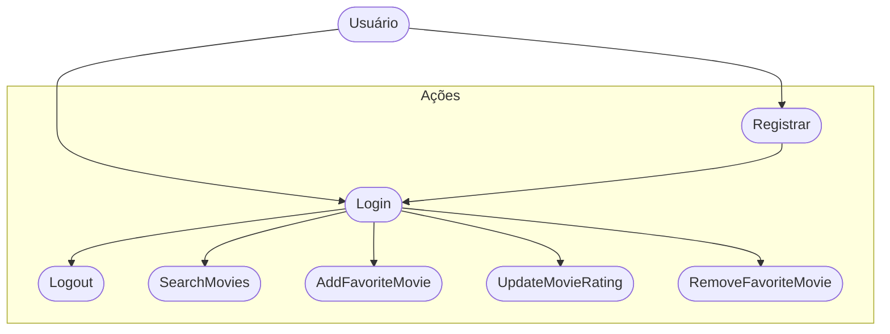

# CineFavorite (Formativa)

## Briefing
Construir um Aplicativo do Zero - O CineFavorite que permitirá criar uma conte e buscar filmes em uma API, montar uma galeria pessoal de filmes favoritos, com poster(capa) e nota avaliativa do usuário para o filme.

## Objetivos
- Criar uma Galeria Personalizada por Usuário de filmes favoritos
- Buscar filmes em uma API e Listar pra selecionar filmes fav
- Criação de contas por Usuario
- Listar filmes por palavra chave

## Levantamento de Requisitos
- ## Funcionais
- Cadastro de usuários – permitir que novos perfis sejam criados utilizando e-mail e senha.
- Login/Logout – possibilitar a entrada e a saída de usuários no sistema.
- Pesquisa de filmes – consultar a API do TMDB a partir de termos fornecidos pelo usuário.
- Exibição de resultados – mostrar os filmes encontrados com título e imagem do pôster.
- Adicionar aos favoritos – permitir que o usuário salve filmes em uma coleção pessoal.
- Atribuição de notas – dar ao usuário a possibilidade de avaliar os filmes marcados como favoritos.
- Edição de avaliação – permitir a alteração da nota atribuída anteriormente.
- Exclusão de favoritos – possibilitar a remoção de filmes da lista pessoal.
- Visualização da coleção – exibir todos os filmes que o usuário favoritou.
- ## Não funcionais
- Conversão de informações – transformar os dados em JSON da API em objetos internos do tipo Movie.
- Integração com o Firestore – realizar leitura, escrita, atualização e exclusão de registros de favoritos.
- Autenticação com Firebase – utilizar o Firebase Auth para controlar o acesso de usuários.
- Persistência de sessão – manter o usuário conectado mesmo após fechar o aplicativo.
- Tratamento de falhas – lidar com erros e exceções sem prejudicar a experiência do usuário.
- Arquitetura modular – organizar o projeto em camadas separando modelos, serviços e interfaces.
- Sincronização em tempo real – atualizar automaticamente os dados de favoritos a partir do Firestore.

## Recursos do Projeto
- Linguagem de programação: Flutter/Dart
- API TMDB: Base de Dados para filmes
- Figma: Prototipagem
- GitHub: Armazenamento e Versionamento do codigo
- Firebase: Authentication / FireStore DB
- VsCode: Codificação / Teste

## Diagramas
1. ### Classe: 
Demostrar o funcionamento das Entidades do Sistema 
- Usuário (User): Classe ja modelada pelo FireBaseAuth
   - Atributos: email, senha, uid
   - Metodos: login, registrar, logout

- Filmes Favorito (Movie): Classe Modelada pelo DEV - Baseada na API TMDB
   - Atributos: id, titulo, PosterPath, Nota
   - Metodos: Adicionar, remover, listar, atualizarNota (CRUD)

   ```mermaid

   classDiagram

    class User{
        +String uid,
        +String email,
        +String password
        +login()
        +logout()
        +register()
    }

   class Movie{
        +int id
        +String title
        +String posterPath
        +double rating
        +addFavorite()
        +removeFavorite()
        +updateMovieRating()
        +getFavoriteMovies()
    }

    User "1"--"1+" Movie : "select"

   ```

   2. ### Uso
   Ação que os Atores podem fazer
   - Usuario:
        - registrar
        - login
        - logout
        - procurar filmes na API
        - salvar filmes nos favoritos
        - dar nota aos filmes favoritos
        - remover filmes dos favoritos




3. ### Fluxo
Determinar o Caminho Percorrido pelo ator pra executar uma Ação

- Fluxo da Ação de Login

```mermaid

    A[Início] --> B{Tela de Login}
    B --> C[Inserir Email e Senha]
    C --> D{Validar as Credenciais}
    D --> Sim --> G[Favorite View]
    D --> Não --> B

```

## Prototipagem

link: https://www.figma.com/design/Z2wQH4iqIVXXBEQTVNs644/Untitled?node-id=0-1&t=aYuwG3p8kOphhvZt-1